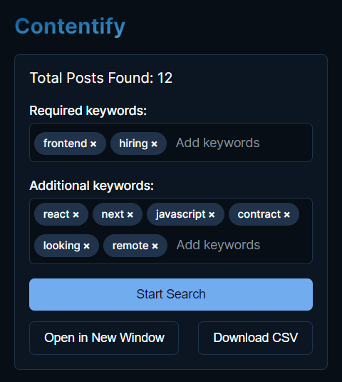
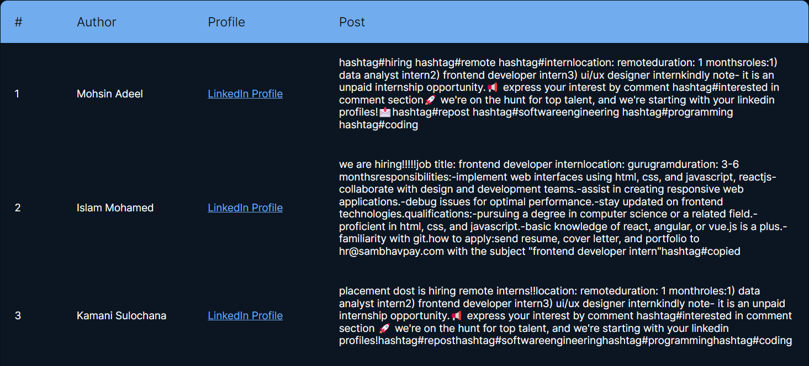

<h1>Contentify - Chrome Extension</h1>

A Chrome extension built with React and TypeScript, only for LinkedIn! It helps you scroll through your feed automatically and grab posts that match your chosen keywords. You can download the results in a CSV file or view them in a table format.

## Features 

<li>
🚀 Seamless Auto-Scroll
</li>
<li>
🔍 Extract relevant posts based on required and additional keywords.
</li>
<li>
📊 Visualize and explore Scraped posts in table form.
</li>
<li>
📁 Download Scraped posts in CSV format. 
</li>

## Installation 

1. Clone this repository.
2. Install pnpm globally: `npm install -g pnpm` (check your node version >= 16.6, recommended >= 18)
3. Run `pnpm install` to install the required dependencies.
4. Run:
    - For Development: `pnpm dev` or `npm run dev`
    - For Production: `pnpm build` or `npm run build`

### In Chrome: 

1. Open a new tab in your browser, type in - `chrome://extensions`, and hit Enter.
2. Check/Enable - `Developer mode`
3. Find and Click - `Load unpacked extension`
4. Select - the `dist` folder present in the repository

## Images 

### Popup 

### Post Table 

